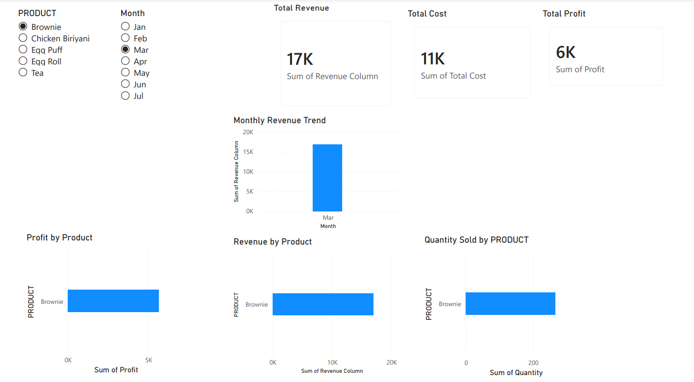

# Bakery Sales Analytics | SQL + Power BI Dashboard
## Dashboard Preview

## Dashboard Description

This dashboard provides a visual summary of sales performance, highlighting revenue trends, product-level insights, and profitability analysis for better business decision-making.

## Project Overview
This project analyzes bakery sales data to identify revenue trends, top-performing products, and profit-driving items using SQL and Power BI. The dashboard enables quick decision-making by highlighting monthly sales patterns and product-level performance.

## Problem Statement
The goal is to understand which products generate the most revenue and profit, and how sales vary across months.

## Tools & Technologies
- Excel (Data Cleaning)
- SQL (Data Analysis)
- Power BI (Data Visualization)

## SQL Analysis Highlights

- Used SQL joins to combine sales and product datasets
- Applied aggregate functions (SUM, COUNT) to calculate revenue and profit
- Identified top-performing products based on revenue and profitability
- Analyzed monthly trends using grouped date-based queries
  
## Key Insights
- Egg Roll generated the highest revenue
- Chicken Biryani delivered the highest profit
- Monthly sales showed consistent growth with seasonal peaks

## Dashboard Features
- Monthly revenue trend analysis
- Product-wise revenue comparison
- Profit analysis by product
- Quantity sold distribution
- Interactive slicers for filtering by product and month

## Files Included
- cleaned_data.csv → dataset
- sales_analysis_queries.sql → SQL queries used
- bakery_sales_dashboard.pbix → Power BI dashboard file
- dashboard_preview.pdf → dashboard preview
  
  ## Business Impact
- Helps identify top-selling and high-profit products
- Supports inventory and pricing decisions
- Enables tracking of monthly performance trends

## Conclusion
This project demonstrates how raw data can be transformed into meaningful business insights using SQL and Power BI.
